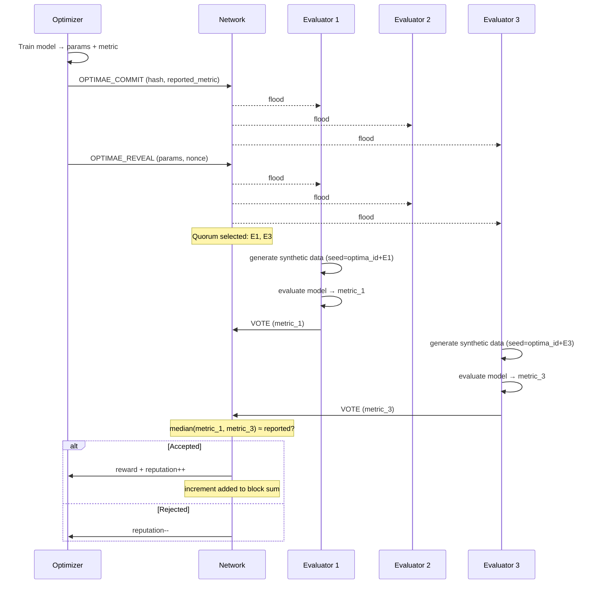

# DOIN Network Architecture & Functionality

> **DOIN** — Decentralized Optimization and Inference Network

---

## Table of Contents

1. [Overview](#1-overview)
2. [Node Architecture](#2-node-architecture)
3. [Domain System](#3-domain-system)
4. [Optimae Lifecycle](#4-optimae-lifecycle)
5. [Block Generation (Proof of Optimization)](#5-block-generation-proof-of-optimization)
6. [Network Protocol](#6-network-protocol)
7. [Plugin System](#7-plugin-system)
8. [Task Queue](#8-task-queue)
9. [Chain Persistence & Sync](#9-chain-persistence--sync)
10. [Installation & Usage](#10-installation--usage)

---

## 1. Overview

DOIN is a **Decentralized Optimization and Inference Network** where nodes collaboratively optimize machine learning models using blockchain consensus. Rather than burning computation on hash puzzles (proof-of-work), DOIN generates blocks through **verified optimization improvements** — every unit of compute contributes to solving real ML problems.

### Core Idea

```
Traditional Blockchain:  compute → hash puzzle → block reward
DOIN:                    compute → ML optimization → verified improvement → block reward
```

Nodes in the network take on different roles — some train models (optimizers), others verify results (evaluators), and all relay messages and maintain the chain. The result is a decentralized system where the "mining" process produces genuinely useful ML artifacts.

### Key Properties

- **Useful work**: All computation goes toward optimizing ML models
- **Decentralized verification**: No single authority decides if an improvement is valid
- **Multi-domain**: The network optimizes many ML problems simultaneously
- **Pluggable**: New ML domains can be added without changing the core protocol
- **Commit-reveal**: Optimizers can't steal each other's results

---

## 2. Node Architecture

Every participant runs a single unified process: **`doin-node`**. There is no separate binary for optimizers vs. evaluators — a single node can fulfill multiple roles depending on its configuration.

### Roles

| Role | Always On? | Function |
|------|-----------|----------|
| **Relay** | ✅ Yes | Forwards messages, maintains the chain, serves the task queue |
| **Optimizer** | Per-domain | Runs ML training, produces optimae (optimization results) |
| **Evaluator** | Per-domain | Verifies optimae using independently generated synthetic data |

Every node is always a relay. Optimizer and evaluator roles are toggled **per domain**.

### Configuration

Nodes are configured via a JSON file:

```json
{
  "node_id": "node-alpha",
  "host": "0.0.0.0",
  "port": 8500,
  "peers": ["http://peer1:8500", "http://peer2:8501"],
  "domains": [
    {
      "domain_id": "timeseries-predictor",
      "optimize": true,
      "evaluate": true,
      "plugin_config": {
        "model_type": "lstm",
        "sequence_length": 128
      }
    },
    {
      "domain_id": "quadratic",
      "optimize": false,
      "evaluate": true,
      "plugin_config": {}
    }
  ]
}
```

A node can optimize in one domain while only evaluating in another, or do both, or neither (pure relay).

### Process Architecture

```
┌─────────────────────────────────────────────────┐
│                   doin-node                      │
│                                                  │
│  ┌───────────┐  ┌────────────┐  ┌────────────┐  │
│  │   Relay   │  │ Optimizer  │  │ Evaluator  │  │
│  │  (always) │  │ (domain A) │  │ (domain A) │  │
│  │           │  │ (domain B) │  │ (domain C) │  │
│  └─────┬─────┘  └─────┬──────┘  └─────┬──────┘  │
│        │              │               │          │
│  ┌─────┴──────────────┴───────────────┴──────┐   │
│  │            Message Bus / Router            │   │
│  └─────┬──────────────┬───────────────┬──────┘   │
│        │              │               │          │
│  ┌─────┴─────┐  ┌─────┴─────┐  ┌─────┴──────┐   │
│  │  Network  │  │   Chain   │  │   Task     │   │
│  │ Transport │  │  Manager  │  │   Queue    │   │
│  └───────────┘  └───────────┘  └────────────┘   │
└─────────────────────────────────────────────────┘
```

---

## 3. Domain System

A **domain** represents a specific ML problem the network is optimizing — for example, timeseries prediction, image classification, or function approximation.

### Properties

- Each domain has a unique `domain_id` string
- Domains are **pluggable** via Python setuptools entry points
- Multiple domains run **simultaneously** — the network optimizes all of them in parallel
- Each domain has its own set of optimizers, evaluators, and optimae

### Entry Points

Three entry point groups define a domain's behavior:

| Entry Point Group | Purpose | Interface |
|-------------------|---------|-----------|
| `doin.optimization` | Training / parameter search | `OptimizationPlugin` |
| `doin.inference` | Running the trained model | `InferencePlugin` |
| `doin.synthetic_data` | Generating verification data | `SyntheticDataPlugin` |

A domain is fully defined by providing implementations for all three plugin types registered under the same `domain_id`.

### Multi-Domain Parallel Optimization

```
Network
├── Domain: "timeseries-predictor"
│   ├── Optimizers: node-1, node-3
│   ├── Evaluators: node-2, node-4, node-5
│   └── Optimae stream → contributes to block generation
│
├── Domain: "image-classifier"
│   ├── Optimizers: node-2, node-6
│   ├── Evaluators: node-1, node-3, node-7
│   └── Optimae stream → contributes to block generation
│
└── Domain: "quadratic" (testing)
    ├── Optimizers: node-8
    ├── Evaluators: node-1, node-2
    └── Optimae stream → contributes to block generation
```

All accepted optimae across all domains contribute to the same block generation process.

---

## 4. Optimae Lifecycle

An **optima** (plural: *optimae*) is the fundamental unit of work in DOIN — a verified optimization result consisting of model parameters and a performance metric. The lifecycle uses a **commit-reveal** scheme to prevent front-running.

### End-to-End Flow

```
Optimizer                    Network                     Evaluators
   │                            │                            │
   │  1. Train model            │                            │
   │  ─────────────►            │                            │
   │  (local computation)       │                            │
   │                            │                            │
   │  2. OPTIMAE_COMMIT         │                            │
   │  hash(params, nonce)       │                            │
   │  ─────────────────────────►│                            │
   │                            │  (flood to all peers)      │
   │                            │───────────────────────────►│
   │                            │                            │
   │  3. OPTIMAE_REVEAL         │                            │
   │  params + nonce            │                            │
   │  ─────────────────────────►│                            │
   │                            │  (flood to all peers)      │
   │                            │───────────────────────────►│
   │                            │                            │
   │                            │  4. Quorum Selection       │
   │                            │  K-of-N evaluators chosen  │
   │                            │  deterministically         │
   │                            │                            │
   │                            │  5. Verification           │
   │                            │◄───────────────────────────│
   │                            │  Each evaluator:           │
   │                            │  - generates unique        │
   │                            │    synthetic data          │
   │                            │  - evaluates model         │
   │                            │  - votes on performance    │
   │                            │                            │
   │                            │  6. Quorum Decision        │
   │                            │  median(verified) ≈        │
   │                            │  reported? → ACCEPT/REJECT │
   │                            │                            │
   │  7. Reputation update      │                            │
   │◄─────────────────────────  │                            │
   │  + reward if accepted      │                            │
```

### Phase 1: Commit

The optimizer trains a model (or runs an optimization step) and produces:
- **Parameters**: the model weights or solution
- **Performance metric**: how well the model performs (e.g., loss, accuracy)

Before revealing the actual parameters, the optimizer broadcasts a **commit message**:

```
OPTIMAE_COMMIT {
  optima_id:    unique identifier
  domain_id:    which domain this belongs to
  optimizer_id: who produced it
  commit_hash:  SHA-256(params || nonce)
  reported_metric: the claimed performance value
  timestamp:    when produced
}
```

The commit hash hides the actual parameters while binding the optimizer to a specific result. This prevents other nodes from stealing the parameters before verification.

### Phase 2: Reveal

After the commit has propagated, the optimizer broadcasts the reveal:

```
OPTIMAE_REVEAL {
  optima_id:    matches the commit
  parameters:   actual model parameters
  nonce:        random value used in commit hash
}
```

Every node independently verifies that `SHA-256(parameters || nonce) == commit_hash`. If the hash doesn't match, the reveal is rejected.

### Quorum Selection

Once a valid reveal is received, the network deterministically selects **K evaluators out of N available** for this domain:

- Selection is deterministic (seeded by `optima_id`) so all nodes agree on the quorum
- The optimizer is **excluded** from the quorum
- K is configured per-domain (e.g., K=3 out of N=10)

### Verification

Each selected evaluator independently:

1. **Generates synthetic data** using the domain's `SyntheticDataPlugin` with a **per-evaluator seed** (derived from `optima_id + evaluator_id`)
2. **Loads the optimizer's parameters** into the domain's model
3. **Evaluates performance** on their unique synthetic dataset
4. **Votes** with their measured metric

Because each evaluator uses different synthetic data, colluding evaluators can't simply agree on a fake result — they'd need to actually run the model to know what metric their unique dataset would produce.

### Quorum Decision

```
reported_metric  = what the optimizer claimed
verified_metrics = [eval_1_metric, eval_2_metric, ..., eval_K_metric]
median_verified  = median(verified_metrics)

if |median_verified - reported_metric| ≤ tolerance:
    ACCEPT optima
else:
    REJECT optima
```

### Incentive Computation

When an optima is accepted, the reward fraction depends on how much of an improvement it represents:

```
reward = f(reported_metric - baseline_metric)
```

The closer the reported and verified metrics, the higher the confidence and the full reward is granted. Significant discrepancies (even within tolerance) may reduce the reward.

### Reputation

- **Accepted optima** → optimizer's reputation increases
- **Rejected optima** → optimizer's reputation decreases (penalized for dishonest or buggy submissions)
- Reputation influences future quorum trust and task priority

---

## 5. Block Generation (Proof of Optimization)

DOIN replaces proof-of-work with **Proof of Optimization** — blocks are generated when enough verified optimization progress accumulates across all domains.

### Mechanism

```
                    Domain A          Domain B          Domain C
                    ────────          ────────          ────────
Accepted optima:    Δa₁, Δa₂         Δb₁              Δc₁, Δc₂, Δc₃
Weighted sum:       w_A·Σ(Δa)    +   w_B·Σ(Δb)    +   w_C·Σ(Δc)

                              ↓

                    If weighted_sum ≥ threshold T
                              ↓
                        Generate Block
```

Each accepted optima contributes its **effective increment** (improvement over the domain's current best) to a running sum. When the weighted sum across **all domains** exceeds a threshold T, a new block is generated.

### Dynamic Threshold Adjustment

Like Bitcoin's difficulty adjustment, the threshold T adapts to maintain a **target block time**:

```
if actual_block_time < target_block_time:
    T increases  (harder to generate blocks)
if actual_block_time > target_block_time:
    T decreases  (easier to generate blocks)
```

This ensures consistent block production regardless of how many optimizers are active or how fast they produce results.

### Block Contents

```
Block {
  index:          sequential block number
  timestamp:      when the block was created
  previous_hash:  hash of the previous block
  transactions: [
    accepted_optimae,     // verified improvements
    rejected_optimae,     // failed verifications
    completed_tasks,      // inference tasks done
    reputation_updates,   // score changes
  ]
  merkle_root:    root hash of all transactions
  block_hash:     SHA-256(index || previous_hash || merkle_root || timestamp)
  threshold_used: the T value when this block was generated
}
```

---

## 6. Network Protocol

### Transport

DOIN uses **HTTP-based transport** via `aiohttp` — chosen for simplicity and debuggability. Every node runs an HTTP server and communicates with peers via standard HTTP requests.

### Message Propagation: Controlled Flooding

Messages propagate through the network using **controlled flooding**:

```
Node A                Node B                Node C                Node D
  │                     │                     │                     │
  │── OPTIMAE_COMMIT ──►│                     │                     │
  │   (TTL=5)           │── OPTIMAE_COMMIT ──►│                     │
  │                     │   (TTL=4)           │── OPTIMAE_COMMIT ──►│
  │                     │                     │   (TTL=3)           │
```

- Each message carries a **TTL** (time-to-live) that decrements at each hop
- Nodes maintain a **deduplication cache** (by message ID) to prevent re-forwarding
- When a node receives a message it hasn't seen before, it forwards to all peers (except sender) with TTL-1

### Message Types

| Message Type | Direction | Purpose |
|-------------|-----------|---------|
| `OPTIMAE_COMMIT` | Flood | Optimizer announces commitment to an optimization result |
| `OPTIMAE_REVEAL` | Flood | Optimizer reveals actual parameters and nonce |
| `BLOCK_ANNOUNCEMENT` | Flood | New block has been generated |
| `CHAIN_STATUS` | Request/Response | Exchange chain height and head hash |
| `BLOCK_REQUEST` | Request | Request specific blocks by index range |
| `BLOCK_RESPONSE` | Response | Return requested blocks |
| `TASK_CREATED` | Flood | New inference/verification task available |
| `TASK_CLAIMED` | Flood | An evaluator has claimed a task |
| `TASK_COMPLETED` | Flood | Task result submitted |
| `PEER_DISCOVERY` | Request/Response | Exchange known peer lists |

### Block Sync Protocol

```
Node (behind)                          Peer (ahead)
     │                                      │
     │── CHAIN_STATUS ────────────────────►  │
     │   {height: 50, head: "abc..."}        │
     │                                      │
     │  ◄──────────────── CHAIN_STATUS ──── │
     │   {height: 75, head: "xyz..."}        │
     │                                      │
     │── BLOCK_REQUEST ───────────────────►  │
     │   {from: 51, to: 75}                  │
     │                                      │
     │  ◄──────────────── BLOCK_RESPONSE ── │
     │   {blocks: [block_51, ..., block_75]} │
     │                                      │
     │  Validate each block:                 │
     │  - index sequential                   │
     │  - previous_hash matches              │
     │  - merkle_root correct                │
     │  - block_hash valid                   │
     │  Append to local chain                │
```

---

## 7. Plugin System

DOIN's plugin system allows new ML domains to be added without modifying the core protocol. Plugins are discovered at runtime via **setuptools entry points**.

### Plugin Types

#### OptimizationPlugin

```python
class OptimizationPlugin:
    def optimize(self, current_params, config) -> (new_params, metric):
        """Run one optimization step. Return new parameters and performance metric."""
        ...
```

#### InferencePlugin

```python
class InferencePlugin:
    def infer(self, params, input_data, config) -> output:
        """Run inference using the given parameters on input data."""
        ...
```

#### SyntheticDataPlugin

```python
class SyntheticDataPlugin:
    def generate(self, seed, config) -> dataset:
        """Generate synthetic evaluation data from a deterministic seed."""
        ...
```

### Entry Point Registration

In a plugin package's `setup.py` or `pyproject.toml`:

```toml
[project.entry-points."doin.optimization"]
timeseries-predictor = "doin_plugins.predictor:PredictorOptimization"

[project.entry-points."doin.inference"]
timeseries-predictor = "doin_plugins.predictor:PredictorInference"

[project.entry-points."doin.synthetic_data"]
timeseries-predictor = "doin_plugins.predictor:PredictorSyntheticData"
```

### Reference Implementations

| Domain | Description | Dependencies |
|--------|-------------|-------------|
| **quadratic** | Minimizes a quadratic function `f(x) = ax² + bx + c` | None (pure Python) |
| **timeseries-predictor** | Timeseries forecasting | Wraps [`harveybc/predictor`](https://github.com/harveybc/predictor) |

#### Quadratic Domain (Testing)

The quadratic domain is a lightweight reference implementation that requires no ML frameworks. It optimizes parameters of a simple quadratic function — useful for testing the full protocol flow without GPU dependencies.

#### Predictor Domain

Wraps the `harveybc/predictor` timeseries prediction system for real ML optimization. The predictor domain interfaces with actual neural network training.

#### Synthetic Data Generation

The synthetic data plugin wraps [`harveybc/timeseries-gan`](https://github.com/harveybc/timeseries-gan) which implements **SC-VAE-GAN** (Self-Conditioned Variational Autoencoder GAN) for generating realistic synthetic timeseries data.

**Bootstrap fallback**: If the GAN model is not available or fails, the plugin falls back to a bootstrap resampling method — drawing samples with replacement from a reference dataset. This ensures evaluators can always generate verification data.

```
Synthetic Data Generation
├── Primary: SC-VAE-GAN (harveybc/timeseries-gan)
│   └── Generates novel timeseries from learned distribution
└── Fallback: Bootstrap resampling
    └── Resamples from reference data with replacement
```

---

## 8. Task Queue

The task queue manages work items — primarily verification tasks (evaluating optimae) and inference requests.

### Design

- **Pull-based**: Evaluators poll the queue for available tasks (no push assignments)
- **Replicated**: The queue state is synced across all nodes via flooding
- **Priority-ordered**: Lower priority number = higher urgency

### Priority Levels

| Priority | Task Type | Description |
|----------|-----------|-------------|
| 0 | Verification | Evaluating an optima (critical path for block generation) |
| 10 | Inference | Running a trained model on user-provided input |

Verification tasks always take precedence — they're required for the consensus mechanism to function.

### Task States

```
         ┌──────────┐
         │ PENDING  │  Task created, waiting for an evaluator
         └────┬─────┘
              │ evaluator claims
              ▼
         ┌──────────┐
         │ CLAIMED  │  An evaluator is working on it
         └────┬─────┘
              │
         ┌────┴────┐
         ▼         ▼
   ┌──────────┐ ┌────────┐
   │COMPLETED │ │ FAILED │  Timeout, error, or evaluator went offline
   └──────────┘ └────────┘
```

- **PENDING**: Task has been created and flooded to all nodes
- **CLAIMED**: An evaluator has announced it's working on the task (prevents duplicate work)
- **COMPLETED**: Results submitted and flooded to the network
- **FAILED**: Task timed out or the evaluator reported an error; may be re-queued

### Synchronization

Task state transitions are broadcast as messages (`TASK_CREATED`, `TASK_CLAIMED`, `TASK_COMPLETED`) using the same controlled flooding mechanism as all other messages.

---

## 9. Chain Persistence & Sync

### Storage

The blockchain is stored locally as **JSON files** — one file per chain, containing all blocks in sequence. This keeps the implementation simple and human-readable for debugging.

```
data/
└── chain.json        # Array of blocks in order
```

### Startup Sync

When a node starts (or reconnects after downtime):

```
1. Load local chain from disk
2. Connect to configured peers
3. Exchange CHAIN_STATUS with each peer
4. Identify peer with longest valid chain
5. Request missing blocks (BLOCK_REQUEST)
6. Validate and append each block
7. Begin normal operation
```

### Live Sync

During operation, when a `BLOCK_ANNOUNCEMENT` is received:

```
if announced_block.index == local_height + 1:
    validate and append
elif announced_block.index > local_height + 1:
    trigger full sync with announcing peer
else:
    already have this block, ignore
```

### Block Validation

Before appending any block, nodes verify:

1. **Index**: Must be exactly `previous_block.index + 1`
2. **Previous hash**: Must equal the hash of the last local block
3. **Merkle root**: Recomputed from transactions must match the block's declared merkle root
4. **Block hash**: `SHA-256(index || previous_hash || merkle_root || timestamp)` must match

If any check fails, the block is rejected and the peer may be flagged.

---

## 10. Installation & Usage

### Prerequisites

- Python 3.9+
- pip

### Install

```bash
# Core library (consensus, chain, protocol types)
pip install git+https://github.com/harveybc/doin-core.git

# Node runtime (networking, task queue, relay)
pip install git+https://github.com/harveybc/doin-node.git

# Domain plugins (quadratic, predictor, synthetic data)
pip install git+https://github.com/harveybc/doin-plugins.git
```

### Configure

Create a `config.json`:

```json
{
  "node_id": "my-node",
  "host": "0.0.0.0",
  "port": 8500,
  "peers": [
    "http://seed1.doin.network:8500",
    "http://seed2.doin.network:8500"
  ],
  "domains": [
    {
      "domain_id": "quadratic",
      "optimize": true,
      "evaluate": true,
      "plugin_config": {}
    }
  ]
}
```

### Run

```bash
doin-node --config config.json
```

### Example: Multi-Node Local Test

```bash
# Terminal 1 — Seed node (relay + optimizer)
doin-node --config seed.json

# Terminal 2 — Evaluator node
doin-node --config evaluator.json

# Terminal 3 — Observer (pure relay)
doin-node --config relay.json
```

---

## Architecture Diagram (Complete)

```
┌─────────────────────────────────────────────────────────────────┐
│                        DOIN Network                             │
│                                                                 │
│  ┌──────────┐      ┌──────────┐      ┌──────────┐              │
│  │  Node A  │◄────►│  Node B  │◄────►│  Node C  │              │
│  │ Opt + Eval│      │ Eval only│      │ Relay    │              │
│  └────┬─────┘      └────┬─────┘      └────┬─────┘              │
│       │                  │                  │                    │
│       └──────────┬───────┴──────────────────┘                   │
│                  │                                               │
│            ┌─────┴─────┐                                        │
│            │  Shared   │                                        │
│            │  Chain    │  ◄── JSON blocks, validated & synced   │
│            └─────┬─────┘                                        │
│                  │                                               │
│       ┌──────────┼──────────┐                                   │
│       ▼          ▼          ▼                                   │
│  ┌─────────┐ ┌────────┐ ┌──────────┐                           │
│  │Domain A │ │Domain B│ │Domain C  │                            │
│  │(predict)│ │(quadr.)│ │(classify)│                            │
│  └─────────┘ └────────┘ └──────────┘                           │
│       │          │          │                                   │
│       └──────────┼──────────┘                                   │
│                  ▼                                               │
│         Proof of Optimization                                   │
│         (weighted sum ≥ T → new block)                          │
└─────────────────────────────────────────────────────────────────┘
```

---

## Optimae Lifecycle Diagram (Mermaid)



---

*This document describes the high-level architecture of the DOIN network. For implementation details, see the source repositories at [github.com/harveybc](https://github.com/harveybc).*
